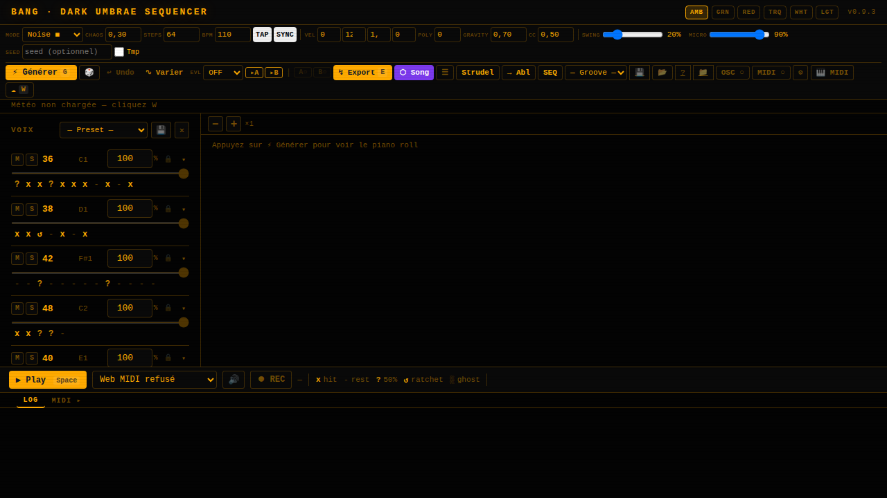
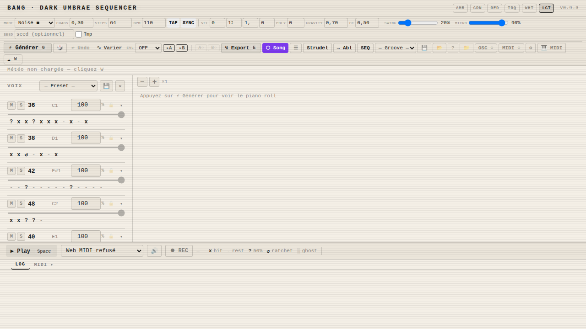
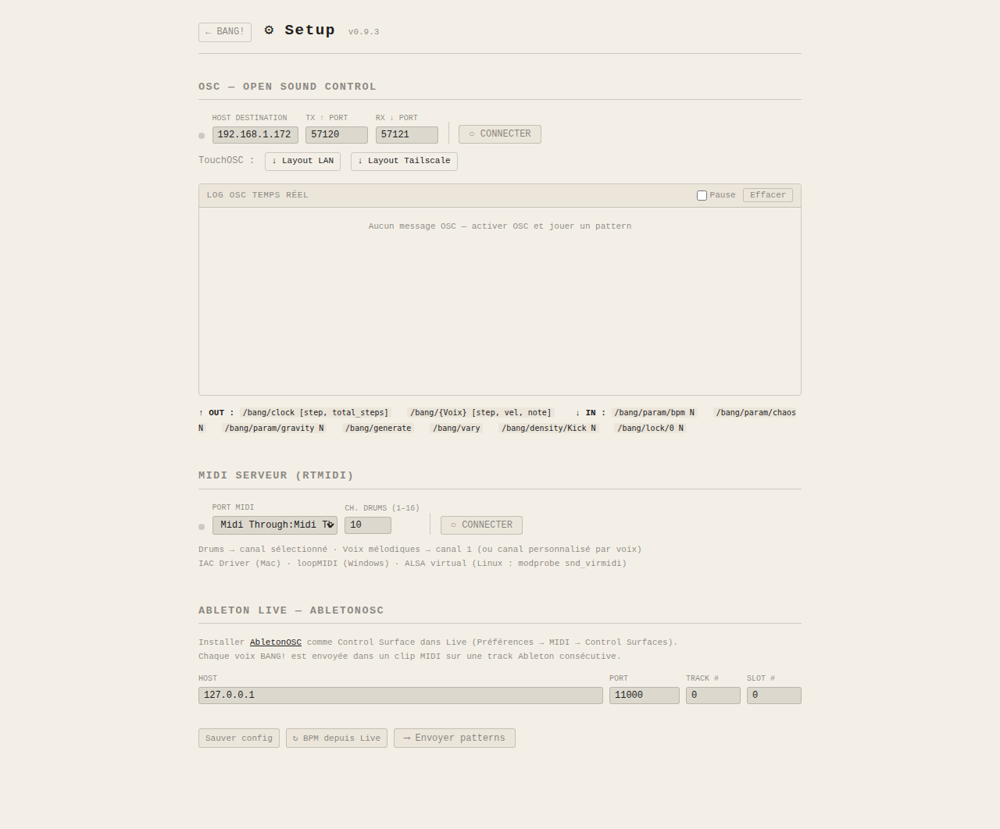

# BANG! — Générateur MIDI algorithmique

> **v0.9.5-alpha** · Dark Umbrae / Robōtariis

BANG! génère des patterns MIDI algorithmiques et les envoie partout — export `.mid`, drag vers Ableton, MIDI serveur rtmidi (sans Chrome), OSC vers SuperCollider/TouchOSC/Max. Le workflow est clair : **Générer → Écouter → Ajuster → Exporter / Jouer**.

---

## Aperçu

<table>
<tr>
<td align="center"><b>Dark (amber)</b></td>
<td align="center"><b>Light (cream)</b></td>
</tr>
<tr>
<td></td>
<td></td>
</tr>
</table>

<table>
<tr>
<td align="center"><b>Page Setup — OSC debugger + config MIDI</b></td>
</tr>
<tr>
<td></td>
</tr>
</table>

---

## Ce que BANG! est

- Un **générateur de patterns** selon des modes qui correspondent à des usages prédéfinis : batterie algorithmique, ligne de basse Markov, synths dédiés (Volca Drum, Volca Kick, Volca FM, MicroFreak, Keystep Pro), ambient, noise, babka euclidien
- Des **presets qui collent au matériel** : notes MIDI et canaux câblés pour Volca Drum (6 canaux split), Volca Kick, Volca FM, MicroFreak, TR-808/909, GM, MPC60, etc.
- Des **gammes configurables** pour les modes mélodiques (Markov, Phase 2, Bassline) : 12 toniques × 8 modes (pentatonique, mineur, dorian, phrygien, majeur, mixolydien, lydien)
- Un **swing** réglable (0–100%) — décalage des steps impairs, appliqué à l'export MIDI et au player
- Une **seed fixe** optionnelle — reproduire exactement un pattern en collant sa seed dans le formulaire
- Un **player intégré** — lecture du pattern dans le navigateur via synthé Web Audio ou MIDI serveur
- Un **synthé navigateur** — preview audio sans matériel MIDI : kick, snare, hihat, tom, mélodie Markov
- Un **MIDI serveur server-side** (`python-rtmidi`) — sortie MIDI sans dépendance Chrome, fonctionne depuis n'importe quel navigateur ou en headless
- Des **clips Ableton** par voix — bouton ↓ drag-and-drop vers la session view d'Ableton
- De la **polymétrie** par voix — cycle indépendant configurable par bouton `Ns` dans le panneau DNA
- Du **MIDI Learn** — capture de pattern depuis un clavier/pad MIDI physique via Web MIDI API (Chrome)
- Des **P-locks par step** pour les synths hardware — automation CC générée algorithmiquement, incluse dans l'export MIDI multi-piste et visualisée dans le pianoroll
- Un **OSC bidirectionnel** — émission et réception UDP depuis un panneau slide-down (SuperCollider, TouchDesigner, Max/MSP, TouchOSC)
- Un **séquenceur de presets** (SEQ) — 8 slots mémoire, avance automatique configurable, poids par slot
- Des **groove presets** — 16 presets musicaux (MPC Boom Bap, Trap, Bossa Nova, Techno, D'n'B…)
- Une **intégration Ableton Live** (AbletonOSC) — push direct des voix comme clips dans la session Ableton, sync BPM
- Un **export Strudel/TidalCycles** — conversion DNA → mini-notation Strudel copiable
- Une **persistance de session** — état complet sauvegardé dans `bang_state.json`, restauré au redémarrage
- Un **tap tempo** et une **synchronisation MIDI clock** — tempo libre (TAP, médiane 5 taps) ou horloge MIDI entrante (SYNC, 24 ppq, transport Start/Stop auto)
- Un **pianoroll temps réel** — SVG avec playhead animé, couleurs par vélocité, P-locks visuels, auto-scroll horizontal
- Une **variation par voix** (`~`) et un **auto-évolve** (×1/×2/×4/×8 cycles)
- Un **Copy / Paste DNA entre voix** — copier le pattern d'une voix et le coller sur une autre
- Un **LFO par voix** — modulation automatique de la densité ou du drop% selon une forme d'onde (sin/tri/ramp/rnd), fréquence en cycles
- Un **Pattern morphing A→B** — interpolation douce sur N cycles entre deux slots SEQ, transition transparente pendant la lecture
- Un **routing MIDI par voix** — assigner un canal MIDI 1–16 fixe par voix (ou "auto"), pour les setups multi-timbre

## Ce que BANG! n'est pas

- Un DAW — aucune gestion de clips, de timeline, de routing audio
- Un plugin — c'est une app web locale, servie par FastAPI sur le réseau local

---

## Installation

### Prérequis

- Python 3.12+
- [uv](https://github.com/astral-sh/uv) — gestionnaire de paquets Python ultra-rapide

```bash
# Installer uv si absent
curl -LsSf https://astral.sh/uv/install.sh | sh
```

### Installation

```bash
git clone git@github.com:obareau/bang.git
cd bang
uv sync
```

### Lancement

```bash
uv run python web.py
# → http://localhost:7777

BANG_PORT=8888 uv run python web.py
```

### Service systemd (production)

```bash
sudo cp bang.service /etc/systemd/system/
sudo systemctl daemon-reload
sudo systemctl enable --now bang
# → http://bang.lan (avec reverse proxy Caddy)
```

Exemple de fichier `bang.service` :
```ini
[Unit]
Description=BANG! MIDI Sequencer
After=network.target

[Service]
User=olivier
WorkingDirectory=/home/olivier/DEV/bang-proto/bang
ExecStart=/home/olivier/.local/bin/uv run python web.py
Environment=BANG_PORT=7777
Restart=always

[Install]
WantedBy=multi-user.target
```

---

## Dépendances

| Paquet | Usage |
|--------|-------|
| `fastapi` | Framework web ASGI |
| `uvicorn` | Serveur ASGI |
| `jinja2` | Templates HTML |
| `python-multipart` | Upload fichiers (session import) |
| `mido` | Génération et export des fichiers `.mid` |
| `python-osc` | OSC UDP bidirectionnel (émission + réception) |
| `python-rtmidi` | MIDI serveur server-side (sans Chrome) |
| `numpy` | Calculs probabilistes, Markov, distributions |
| `httpx` | Requête météo Scaër (open-meteo.com) |

**Côté navigateur (CDN, pas d'installation) :**

| Bibliothèque | Usage |
|--------------|-------|
| HTMX | Requêtes partielles sans rechargement de page |
| Web MIDI API | Player MIDI + MIDI Learn (Chrome/Chromium uniquement) |
| Web Audio API | Synthé navigateur (tous navigateurs modernes) |

---

## Compatibilité navigateur

| Fonctionnalité | Chrome/Chromium | Firefox | Safari | Edge |
|----------------|----------------|---------|--------|------|
| Interface HTMX | ✅ | ✅ | ✅ | ✅ |
| Player Web Audio (synthé) | ✅ | ✅ | ✅ | ✅ |
| **MIDI serveur rtmidi** | ✅ | ✅ | ✅ | ✅ |
| Web MIDI (player MIDI) | ✅ | ❌ | ❌ | ✅ |
| Web MIDI (MIDI Learn) | ✅ | ❌ | ❌ | ✅ |
| Drag → Ableton (DownloadURL) | ✅ | ❌ | ❌ | ✅ |

> **MIDI serveur (bouton SRV)** fonctionne dans tous les navigateurs — le MIDI est envoyé depuis Python sur le serveur. Web MIDI (player direct + MIDI Learn) requiert Chrome/Chromium.

---

## Résolution de problèmes

### Le player ne démarre pas / "No MIDI output"

- **Avec Chrome/Chromium** : cliquer `🎹 MIDI` → sélectionner un port de sortie MIDI dans la liste. Si la liste est vide, vérifier que le port MIDI est connecté avant d'ouvrir le navigateur.
- **Sans port MIDI** : le player utilise automatiquement le synthé navigateur (Web Audio). Cliquer directement `▶ Play`. Si ça ne démarre pas, cliquer d'abord n'importe où sur la page (contrainte autoplay navigateur) puis relancer.
- **Avec Firefox/Safari** : Web MIDI non supporté → le player utilise toujours le synthé navigateur. Fonctionnalités MIDI Learn et drag Ableton indisponibles.

### MIDI Learn ne capte rien

- Web MIDI n'est disponible que sur Chrome/Chromium — Firefox et Safari ne le supportent pas.
- Vérifier que le port MIDI entrant est sélectionné dans le modal `🎹 MIDI` (port IN, pas OUT).
- Le mode armé attend un signal MIDI : jouer une note sur le clavier pour déclencher le count-in.

### Drag vers Ableton ne fonctionne pas

- La fonction `DownloadURL` est Chrome/Chromium only. Sur Firefox, utiliser le bouton ↓ pour télécharger puis importer manuellement dans Ableton.
- Dans Ableton, glisser dans la Session View ou l'Arrangement View (pas dans le navigateur de fichiers).
- Ableton doit être visible à l'écran pendant le drag (glisser directement sur une piste MIDI ou une cellule vide).

### `uv sync` échoue — dépendances

```bash
# python-osc peut nécessiter des outils de build
sudo apt install python3-dev build-essential

# Relancer
uv sync
```

### Port 7777 déjà utilisé

```bash
# Lancer sur un autre port
BANG_PORT=8888 uv run python web.py

# Ou trouver ce qui utilise le port
sudo lsof -i :7777
```

### OSC ne reçoit pas de messages

- Le port d'écoute par défaut est `57121` (UDP). Vérifier le firewall :
  ```bash
  sudo ufw allow 57121/udp
  ```
- Le serveur RX redémarre à chaud quand le port change dans le modal OSC — pas besoin de relancer BANG.

### Export `.mid` vide ou silencieux

- Cliquer `Générer` avant `Export` — BANG ne génère pas automatiquement au démarrage.
- Pour le mode `weather` : si la météo est indisponible (pas d'internet), BANG utilise des valeurs par défaut. Cliquer `W` pour forcer le refresh.

---

## Modes

| Mode | Cible | Steps | Description |
|------|-------|-------|-------------|
| `morph` | Batterie | libre | DNA morphé + mutation chaos |
| `random` | Batterie | libre | DNA entièrement aléatoire |
| `weather` | Batterie | libre | Densité/texture depuis météo Scaër |
| `markov` | Batterie + mélodie | libre | Voix mélodique chaîne de Markov + drone CC |
| `phase2` | Batterie + mélodie | libre | Markov + kick polyrhythmique + météo CC |
| `noise` | Batterie | libre | 8 voix, cycles asymétriques — percussion industrielle |
| `ambient` | Ambiance | libre | 3 voix ultra-sparse |
| `babka` | Batterie | libre | Syntaxe Babka (subdivision, euclidien, alternance) |
| `bassline` | Basse | ≤128 | Ligne de basse Markov, 2 voix, portamento CC |
| `volca_kick` ★ | Korg Volca Kick | ≤16 | 1 voix + P-locks (Pitch, Decay, Drive, Fold, BitRed) |
| `volca_fm` ⚡ | Korg Volca FM | ≤16 | 3 voix polyphoniques FM + P-locks sur FM1 |
| `volca_drum` ★ | Korg Volca Drum | ≤16 | 6 parts, 6 canaux MIDI, P-locks par part |
| `microfreak` ◈ | Arturia MicroFreak | ≤64 | 3 voix paraphoniques + P-locks (Cutoff, Timbre, LFO) |
| `keystep_pro` ♜ | Arturia Keystep Pro | 16 | 3 voix drums (ch10) + 4 pistes Markov indépendantes (ch1–4) |

---

## Contrôles par voix

Chaque voix dispose de contrôles individuels dans le panneau central. Les contrôles sont organisés en trois onglets : **DNA** (édition du pattern), **MOD** (modulation), **VEL** (vélocité et probabilité).

### Lock 🔒

Verrouille une voix : elle ne sera **pas régénérée** lors des prochains clics sur `Generate`. Bordure colorée = voix verrouillée.

### Densité (0–1)

Slider par voix qui multiplie la probabilité de déclenchement. `1.0` = normal · `0.5` = moitié des triggers · `0.0` = silence.

### Drop % (tab MOD)

Probabilité que la voix joue pendant un cycle complet. `100%` = toujours · `50%` = silencieuse un cycle sur deux (décision aléatoire en début de cycle).

### Swing par voix (tab MOD)

Décalage des steps impairs de 0 à 100%. S'applique en parallèle du swing global. Chaque voix peut swinguer à une intensité différente.

### LFO par voix (tab MOD)

Modulation automatique de la `densité` ou du `drop%` selon une forme d'onde :

| Forme | Comportement |
|-------|-------------|
| `sin` | Sinusoïde douce |
| `tri` | Triangle (montée/descente linéaire) |
| `ramp` | Rampe montante |
| `rnd` | Aléatoire indépendant à chaque évaluation |

- **Fréquence** : en cycles (÷4 / ÷2 / ×1 / ×2 / ×4 / ×8 boucles)
- **Profondeur** : 0–100% — amplitude de la modulation
- **Cible density** : phase recalculée à chaque step (modulation intra-cycle)
- **Cible drop** : phase recalculée en début de cycle (décision toutes les N boucles)
- Appliqué dans le player navigateur **et** dans le MIDI serveur rtmidi

### MIDI ch par voix (tab MOD)

Assigne un canal MIDI fixe (ch1–ch16) ou `auto` (drums → ch10, mélodique → ch1) pour cette voix uniquement. Utile pour les setups multi-timbre.

### Copy / Paste DNA (tab DNA)

Bouton `C` copie le DNA de la voix dans le presse-papier interne. Bouton `P` (actif après une copie) colle le DNA sur n'importe quelle autre voix. Ne nécessite pas de rechargement.

### Transformations DNA (tab DNA)

| Bouton | Effet |
|--------|-------|
| `↔` | Inverse le DNA (premier step ↔ dernier) |
| `↺` | Rotation d'un step vers la droite |
| `×2` | Double le DNA (concatène le pattern sur lui-même) |
| `÷2` | Réduit le DNA de moitié (garde les N/2 premiers steps) |
| `~` | Variation légère de cette voix seule |

### Euclidien — bouton E

Remplace le DNA par un rythme euclidien E(n, k). Entrer k (hits), valider avec Entrée.

### Polymétrie — bouton `Ns`

Définit un cycle indépendant de N steps pour cette voix. Le DNA est tronqué ou répété pour correspondre à N. `0` = reset. Le pianoroll affiche les marqueurs de frontière. Survive aux `∿ Varier`.

### MIDI Learn — bouton ⏺

Lance la capture de pattern depuis MIDI entrant. Count-in 2 steps, puis capture d'un cycle complet quantifié sur la grille. Chrome/Chromium uniquement.

### Velocity lane (tab VEL)

Drawbar par step (0–127). Remplace la vélocité algorithmique step par step. Drag pour modifier plusieurs steps d'un trait.

### Probability lane (tab VEL)

Barre de probabilité par step (0–100%). Remplace la probabilité du DNA (`x` = 100%, `?` = 50%) step par step. Les steps à probabilité réduite affichent une barre ambre en tête du pianoroll.

### Clips Ableton — bouton ↓

Télécharge le clip MIDI de cette voix uniquement. Draggable vers la session Ableton (Chrome/Chromium). Le label dans le pianoroll est aussi cliquable.

### Chord selector (voix Markov / KSP)

Transforme chaque note en accord : mono, power, minor, major, sus2, sus4, m7, M7, dom7, dim, aug.

---

## Player intégré

### Modes de lecture

Le player bas de page lit le pattern courant en temps réel, synchronisé avec le pianoroll.

- **Web MIDI** (Chrome) : sélectionner un port de sortie dans le modal `🎹 MIDI`. Toutes les voix sont envoyées sur le port sélectionné.
- **Synthé navigateur** : actif automatiquement si aucun port MIDI. Aussi accessible via le bouton `🔊` même quand un port MIDI est connecté.

### Toggle 🔊 Synth

Force le synthé navigateur même en présence d'un port MIDI connecté. Le MIDI physique reste actif en parallèle — les deux jouent simultanément. Utile pour monitorer sans casque sur le matériel.

---

## Toolbar

| Bouton | Description |
|--------|-------------|
| `⚡ Générer` | Génère un nouveau pattern complet |
| `Export` | Exporte le `.mid` courant |
| `∿ Varier` | Mutation légère sans régénération (raccourci `V`) |
| `↩` | Undo — restaure l'état précédent (ring buffer 5 snapshots) |
| `🎲` | Randomize BPM + tous les paramètres en un clic |
| `▸A` / `▸B` | Store — sauvegarde l'état dans le slot A ou B |
| `A○` / `B○` | Load — charge le slot A ou B (● = slot rempli) |
| `SEQ` | Panneau séquenceur de presets (8 slots, morphing, avance auto) |
| `OSC ○/●` | Toggle OSC on/off — config dans `/setup` |
| `MIDI ○/●` | Ouvre `/setup` sur la section MIDI serveur |
| `🎹 MIDI` | Modal sélection port MIDI (Web MIDI, Chrome uniquement) |
| `TAP` | Tap tempo (médiane 5 taps) |
| `SYNC` | Synchronisation MIDI clock entrant (24 ppq) |
| `→ Abl` | Push vers Ableton Live via AbletonOSC |
| `Strudel` | Export pattern en mini-notation Strudel/TidalCycles |
| `📁` | Page `/files` — liste et téléchargement des exports MIDI |
| `⚙` | Page `/setup` — config OSC, MIDI serveur, Ableton, debugger OSC TX/RX |
| `AMB/GRN/RED/TRQ/WHT/LGT` | Thèmes visuels — persistés dans localStorage |

### Raccourcis clavier

| Touche | Action |
|--------|--------|
| `G` | Générer |
| `E` | Exporter MIDI |
| `V` | Varier (mutation légère) |
| `W` | Rafraîchir météo |

---

## Séquenceur de presets (SEQ)

Le panel SEQ (`SEQ` dans le toolbar) gère 8 slots mémoire pour stocker et rappeler des patterns complets.

### Slots

- **💾** : sauvegarde le pattern courant dans un slot
- **Clic sur le slot** : charge le slot comme pattern actif
- **×** : vide le slot
- **Poids (1–9)** : fréquence de sélection en mode AUTO

### Avance automatique (AUTO)

`▶ AUTO` active l'avance entre slots pendant la lecture. `cycles/slot` définit combien de cycles le player reste sur chaque slot avant de passer au suivant. Le slot suivant est tiré au sort parmi les slots remplis, pondéré par les poids.

### Pattern morphing A→B

La section MORPH interpole en douceur entre deux slots sur N cycles :

1. Stocker deux patterns différents dans deux slots (ex: slot 1 et slot 2)
2. Sélectionner le slot source et le slot cible dans les sélecteurs MORPH
3. Choisir le nombre de cycles
4. Cliquer `▶` — la barre orange progresse pendant la lecture
5. À 100%, le slot cible est chargé automatiquement côté serveur

**Algorithme** : pour chaque step et chaque voix, la probabilité et la vélocité sont interpolées linéairement entre les deux patterns. Les steps présents dans un seul des deux patterns disparaissent ou apparaissent progressivement.

---

## OSC Bidirectionnel

BANG émet et reçoit des messages OSC UDP.

### Activer

Page `/setup` (bouton `⚙`) → section OSC → configurer Host + PORT TX + PORT RX → Connecter. Le bouton `OSC ○` du toolbar reflète l'état et permet un toggle rapide.

Défaut TX : `127.0.0.1:57120` · Défaut RX : `0.0.0.0:57121`

### Messages sortants (↑ TX)

| Message | Arguments |
|---------|-----------|
| `/bang/clock` | `[step, total_steps]` |
| `/bang/{NomVoix}` | `[step, velocity, note]` |

### Messages entrants (↓ RX)

| Message | Arguments |
|---------|-----------|
| `/bang/param/bpm` | `int` (40–240) |
| `/bang/param/chaos` | `float` (0–1) |
| `/bang/param/gravity` | `float` (0–1) |
| `/bang/param/swing` | `float` (0–1) |
| `/bang/param/microtiming` | `float` (0–1) |
| `/bang/param/steps` | `int` (8–256) |
| `/bang/param/cc_depth` | `float` (0–1) |
| `/bang/generate` | — |
| `/bang/vary` | — |
| `/bang/density/{NomVoix}` | `float` (0–1) |
| `/bang/lock/{idx}` | `int` (0 ou 1) |

---

## MIDI serveur (rtmidi)

Depuis v0.9.0, BANG! peut envoyer le MIDI directement depuis le serveur Python, sans dépendance Web MIDI / Chrome.

### Activer

Page `/setup` (bouton `⚙`) → section MIDI Serveur → sélectionner un port (physique ou virtuel) → Connecter. Le bouton `MIDI ○/●` du toolbar reflète l'état.

### Comportement

- Drums → canal 9 (GM standard) · voix mélodiques → canal 0 (auto)
- **Canal MIDI par voix** — tab MOD → `ch MIDI` → overrider le canal auto (1–16) pour chaque voix indépendamment
- **LFO** appliqué côté serveur (density et drop) — cohérent avec le player navigateur
- Gate : 75% de la durée du step
- Horloge synchronisée sur le BPM courant de BANG!
- Fonctionne en parallèle du player Web Audio (les deux peuvent jouer simultanément)

### Prérequis

```bash
# Vérifier que python-rtmidi est installé
uv sync

# Lister les ports MIDI disponibles sur le serveur
curl http://localhost:7777/midi/ports
```

---

## Syntaxe DNA

| Symbole | Comportement |
|---------|-------------|
| `x` | Trigger — vélocité 105, 100% |
| `-` | Silence |
| `?` | Probabiliste 50% |
| `↺` | Ratchet ×3 |
| `░` | Ghost — jitter ±25ms |

---

## API HTTP

### Génération et export

| Méthode | Route | Description |
|---------|-------|-------------|
| GET | `/` | Interface principale |
| POST | `/generate` | Génère patterns + pianoroll |
| POST | `/vary` | Mutation légère du pattern courant |
| POST | `/export` | Exporte le `.mid` courant |
| GET | `/export/clip?idx=N` | Clip MIDI mono-voix (voix N) |
| GET | `/export/clips` | Zip de tous les clips MIDI |
| GET | `/export/strudel` | Pattern en notation Strudel/TidalCycles |
| GET | `/pattern` | Données player JSON (BPM, steps, events, drones) |
| POST | `/undo` | Restaure snapshot précédent (ring buffer 5) |

### Voix

| Méthode | Route | Description |
|---------|-------|-------------|
| POST | `/voice/pattern` | Valide le DNA édité manuellement |
| POST | `/voice/vary` | Variation légère d'une voix seule |
| POST | `/voice/regen` | Régénère une voix seule |
| POST | `/voice/thin` | Thinning ×1/÷2/÷4 |
| POST | `/voice/density` | Densité par voix (0–1) |
| POST | `/voice/drop` | Drop% par voix (0–100) |
| POST | `/voice/chord` | Accord voix Markov/KSP |
| POST | `/voice/euclidean` | Applique E(n,k) |
| POST | `/voice/steps` | Cycle indépendant polymétrie (0 = reset) |
| POST | `/voice/offset` | Décalage de phase en steps |
| POST | `/voice/rotate` | Rotation du DNA d'un step |
| POST | `/voice/invert` | Inversion du DNA |
| POST | `/voice/reverse` | Miroir du DNA |
| POST | `/voice/double` | Double le DNA (×2 longueur) |
| POST | `/voice/halve` | Réduit le DNA de moitié |
| POST | `/voice/lfo` | LFO par voix (shape/target/freq/depth) |
| POST | `/voice/swing` | Swing par voix (0–100%) |
| POST | `/voice/midi_ch` | Canal MIDI par voix (-1 = auto) |
| POST | `/voice/vel_lane` | Velocity lane (liste 0–127 par step) |
| POST | `/voice/prob_lane` | Probability lane (liste 0–100 par step) |
| POST | `/voice/preview` | Aperçu audio navigateur (Web Audio) |
| POST | `/lock_voice` | Toggle lock voix |
| POST | `/poly` | Limite de polyphonie globale |
| POST | `/notes` | Remap notes MIDI par voix |

### Slots A/B et SEQ

| Méthode | Route | Description |
|---------|-------|-------------|
| POST | `/ab/store` | Sauvegarde slot A ou B |
| POST | `/ab/load` | Charge slot A ou B |
| POST | `/seq/save` | Sauvegarde pattern dans un slot SEQ (0–7) |
| POST | `/seq/load` | Charge un slot SEQ comme pattern actif |
| POST | `/seq/clear` | Vide un slot SEQ |
| POST | `/seq/advance` | Avance automatique vers le slot suivant (pondéré) |
| POST | `/seq/config` | Configure cycles/slot |
| POST | `/seq/weight` | Poids de sélection d'un slot (1–9) |
| GET | `/morph/prepare` | Prépare le morphing entre deux slots (events JSON) |

### OSC

| Méthode | Route | Description |
|---------|-------|-------------|
| POST | `/osc/toggle` | Active/désactive OSC |
| POST | `/osc/config` | Configure host:port TX/RX |
| GET | `/osc/log` | Derniers messages OSC TX/RX (HTML partiel HTMX) |
| POST | `/osc/log/clear` | Vide le log OSC |

### MIDI serveur

| Méthode | Route | Description |
|---------|-------|-------------|
| GET | `/midi/ports` | Liste les ports MIDI disponibles (rtmidi) |
| POST | `/midi/toggle` | Active/désactive MIDI serveur |
| POST | `/midi/config` | Configure port MIDI serveur |

### Grooves et presets

| Méthode | Route | Description |
|---------|-------|-------------|
| GET | `/grooves` | Liste des groove presets |
| POST | `/groove/apply` | Applique un groove preset |
| GET | `/presets` | Liste des presets de drum machine |
| POST | `/preset/apply` | Applique un preset |
| POST | `/preset/save` | Sauvegarde un preset custom |
| DELETE | `/preset/{name}` | Supprime un preset custom |

### Ableton, session, divers

| Méthode | Route | Description |
|---------|-------|-------------|
| GET | `/ableton/sync_bpm` | Sync BPM depuis Ableton via AbletonOSC |
| POST | `/ableton/config` | Configure host:port Ableton |
| POST | `/ableton/send` | Push toutes les voix vers Ableton |
| GET | `/session/export` | Exporte session JSON complète |
| POST | `/session/import` | Charge session JSON |
| GET | `/files` | Liste les exports MIDI du serveur |
| GET | `/setup` | Page de configuration (OSC, MIDI, Ableton) |
| GET | `/doc` | Documentation in-app |
| POST | `/weather` | Rafraîchit les données météo Scaër |

---

## Structure

```
bang/
├── bang_engine.py      # Moteur (DNA, Markov, MIDI, météo, seeds)
├── babka.py            # Parser Babka
├── cli.py              # CLI + contrôleurs MIDI
├── web.py              # Interface Web FastAPI+HTMX
├── templates/
│   ├── index.html      # UI principale (HTMX + player Web MIDI/Audio)
│   ├── setup.html      # Page config — OSC debugger, MIDI SRV, Ableton
│   ├── _voices.html    # Panneau voix (partiel HTMX)
│   ├── _pianoroll.html # Pianoroll SVG (partiel HTMX)
│   └── doc.html        # Documentation in-app
├── docs/
│   └── screenshots/    # Captures d'écran pour README
└── exports/            # Fichiers .mid générés
```

---

## BangEngine — API Python

```python
from bang_engine import BangEngine, build_markov_chain, SCALE_INTERVALS

e = BangEngine(bpm=120, vel_floor=20, vel_ceiling=110, vel_curve=0.7)
e.add_voice(36, "x---x---")
e.add_voice(42, ["x-x-", "x--x"])  # polyrythmie

chain = build_markov_chain(root_note=50, intervals=SCALE_INTERVALS["dorian"], num_octaves=2)
e.add_markov_voice(chain, "x-?-", channel=0)

e.add_babka_voice(38, "x(3,8)")
e.add_cc_drone(control=74, breakpoints=[20, 100, 20])

e.export_midi(
    num_steps=64, filename="out.mid", swing=0.3, seed="abc123",
    voice_chords={"markov-ch1": "minor"},
)
```

---

## Licence

Projet réalisé dans le cadre du méta-univers **Robōtariis**.
